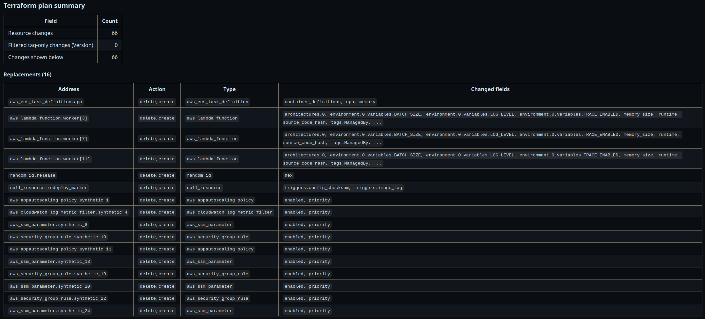
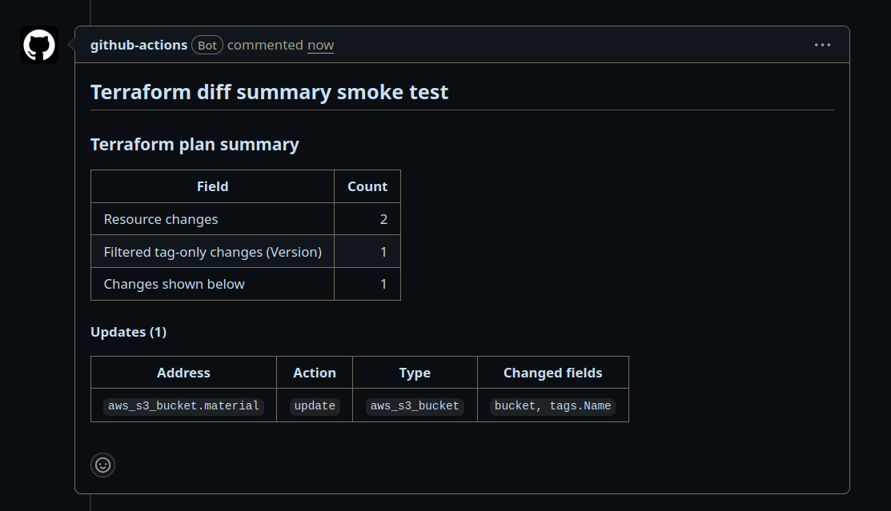

# Terraform Diff Summary

A small GitHub Action that writes a compact Terraform plan summary to the
GitHub Step Summary.

It is useful when tags make Terraform plans noisy. By default, it filters out
resource updates where the only effective change is `tags.Version` or
`tags_all.Version`. You can configure one or more ignored tag names, disable
tag-only filtering, and customize the summary heading.

The summary deliberately shows changed field paths rather than before/after
values, so it gives reviewers useful context without dumping potentially
sensitive Terraform values into the Step Summary.

## Usage

```yaml
- name: Terraform Plan
  run: terraform plan -out=tfplan

- name: Terraform Plan JSON
  run: terraform show -json tfplan > tfplan.json

- name: Terraform Diff Summary
  uses: your-org/terraform-diff-summary@v1
  with:
    plan-json-path: tfplan.json
    ignored-tag-names: Version,Build
    fail-on-replace: "true"
    comment-on-pr: "true"
```

## Inputs

| Name | Required | Default | Description |
|---|---:|---|---|
| `plan-json-path` | yes | n/a | JSON from `terraform show -json tfplan`. |
| `version-tag-name` | no | `Version` | Legacy single ignored tag key. |
| `ignored-tag-names` | no | n/a | Comma-separated tag keys to ignore. |
| `filter-tag-only-changes` | no | `true` | Hide ignored-tag-only updates. |
| `max-changed-fields` | no | `8` | Field path cap per resource before `...`. |
| `summary-title` | no | `Terraform plan summary` | Markdown summary heading. |
| `fail-on-destroy` | no | `false` | Fail when visible delete changes exist. |
| `fail-on-replace` | no | `false` | Fail when visible replacements exist. |
| `summary-output-path` | no | n/a | Also append Markdown to this file path. |
| `comment-on-pr` | no | `false` | Create or update a pull request comment. |
| `comment-title` | no | `Terraform diff summary` | PR comment heading. |

## Output

The action appends Markdown to `$GITHUB_STEP_SUMMARY`.

When `comment-on-pr` is `true`, the action also creates or updates a single
marked pull request comment. The workflow must grant `pull-requests: write`:

```yaml
permissions:
  contents: read
  pull-requests: write
```

Example:



PR Comment example:


```md
### Terraform plan summary

| Field                                      | Count |
| ------------------------------------------ | ----: |
| Resource changes                           |    12 |
| Filtered tag-only changes (Version, Build) |     9 |
| Changes shown below                        |     3 |

#### Replacements (1)

| Address            | Action          | Type           | Changed fields       |
| ------------------ | --------------- | -------------- | -------------------- |
| `aws_instance.api` | `delete,create` | `aws_instance` | `ami, instance_type` |

#### Updates (2)

| Address               | Action   | Type              | Changed fields  |
| --------------------- | -------- | ----------------- | --------------- |
| `aws_ecs_service.api` | `update` | `aws_ecs_service` | `desired_count` |
```

## Local Development

Install dependencies:

```bash
poetry install
```

Run the script directly:

```bash
PLAN_JSON_PATH=tfplan.json \
IGNORED_TAG_NAMES=Version,Build \
FILTER_TAG_ONLY_CHANGES=true \
MAX_CHANGED_FIELDS=8 \
SUMMARY_TITLE="Terraform plan summary" \
FAIL_ON_DESTROY=false \
FAIL_ON_REPLACE=true \
COMMENT_ON_PR=false \
COMMENT_TITLE="Terraform diff summary" \
GITHUB_STEP_SUMMARY=/tmp/summary.md \
python scripts/terraform_diff_summary.py
```

Run tests:

```bash
poetry run test
```

Run lint checks:

```bash
poetry run ruff check .
```

## Notes

This action does not run `terraform plan` for you. It only summarises an
existing JSON plan generated with:

```bash
terraform show -json tfplan > tfplan.json
```

`fail-on-destroy` and `fail-on-replace` are evaluated after tag-only filtering.
Filtered tag-only updates will not cause the action to fail.
